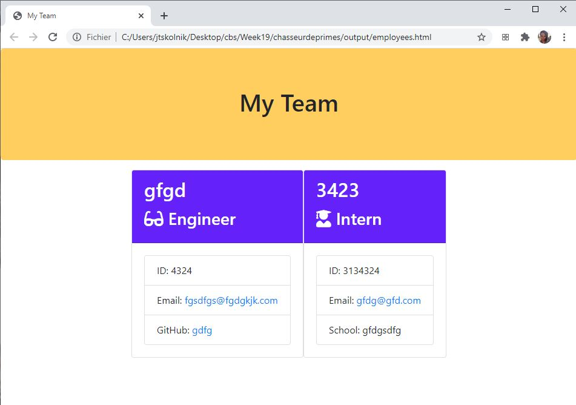

# chasseurdeprimes 

# Table of contents
1. [Description](#Description)
2. [Installation instructions](#Installation-instructions)
3. [Usage](#usage)
4. [Contributions](#Contributions)
5. [Testing instructions](#Testing-instructions)
6. [License](#License)
7. [Questions](#Questions)

## Description: 
This is a command-line application that generates an HTML file of all of the employees on a team. There are three roles: engineer, manager, and intern. Depending on the role of the employee, the manner they are displayed in the HTML file changes.

A video of the working application can be found <a href="https://www.youtube.com/watch?v=s7btoE7hhIY&feature=youtu.be">here</a>.

This is what the generated HTML looks like:

## Installation instructions: 
Download the program, then run npm install. To run, open the terminal and write "node app.js".

## Usage: 
This is targeted to users who need to write HTML files quickly and easily but don't want to spend the time with the syntax.

## Contributions: 
This is currently a solo project of skolnikskolnik.

## Testing instructions: 
Navigate to the /test/ folder in the terminal then enter "npm run test" to see that all tests pass.

## License:  
This project is covered under the MIT License license.

## Questions
Visit my <a href='https://www.github.com/skolnikskolnik'>github page.</a> 

Email me at jtskolnik@gmail.com with any additional questions you may have. I am always happy to talk to users of my product!
    